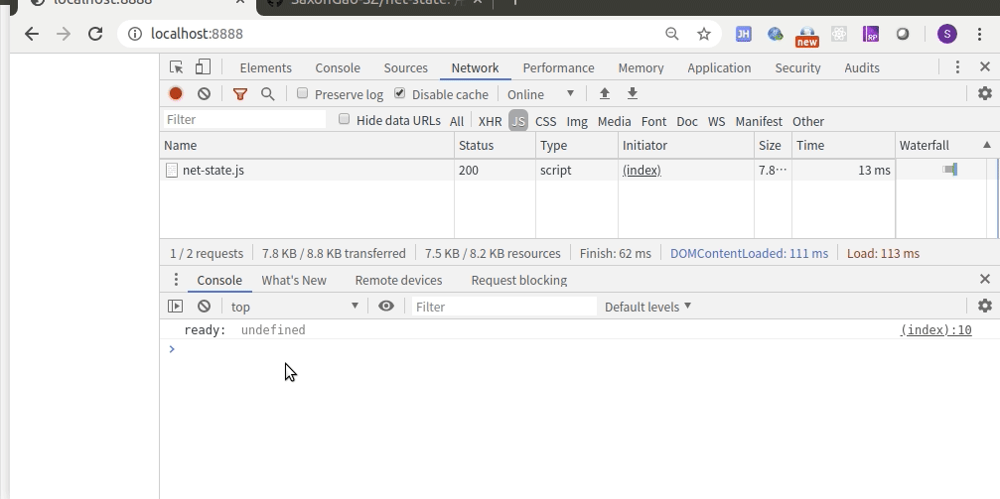

# net-state
用于检测web、小程序端设备是否在线，以及监听网络状态变化。


# Example

```html
<!DOCTYPE html>
<html>
    <head>

    </head>
    <body>
        <script src="./dist/net-state.js"></script>
        <script>
            var ns = new NetState(false, (param) => {
                console.log('ready: ', param);
            });
            var onOnLineHandler = function (param) {
                var dt = new Date();
                console.log('onLine:', param, dt.getSeconds());
            }
            var onOffLineHandler = function (param) {
                var dt = new Date();
                console.log('offLine:', param, dt.getSeconds());
            }
            ns.on(ns.EVENT.ONLINE, onOnLineHandler, this);
            ns.on(ns.EVENT.OFFLINE, onOffLineHandler, this);
        </script>
    </body>
</html>
```

# Test

- OS : Ubuntu 
- Browser : Chromuim 79




